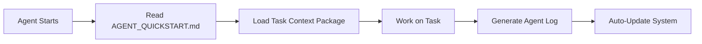

# Portfolio Documentation Architecture

## Core Philosophy
Drawing inspiration from SWE-Factory's automated pipeline approach and AutoMind's knowledge base system, we'll create a **contextual documentation graph** that provides just-enough information for AI agents while maintaining sustainability.

## Documentation Structure

### 1. **Entry Points** (Always Current)
```
/docs/
├── AGENT_QUICKSTART.md     # Essential context for new AI agents
├── CURRENT_STATE.md        # Auto-generated current system state
└── TASK_CONTEXTS/          # Pre-built context packages for common tasks
    ├── navigation-fixes.md
    ├── mdx-enhancement.md
    ├── mobile-optimization.md
    └── 3d-integration.md
```

### 2. **Knowledge Nodes** (Modular Information)
```
/docs/knowledge/
├── architecture/
│   ├── file-structure.md
│   ├── routing-system.md
│   ├── theme-engine.md
│   └── mdx-pipeline.md
├── components/
│   ├── 3d-components.md
│   ├── card-system.md
│   └── navigation.md
├── workflows/
│   ├── adding-projects.md
│   ├── creating-themes.md
│   └── debugging-guides.md
└── integrations/
    ├── github-pages.md
    ├── vite-config.md
    └── external-apis.md
```

### 3. **Agent Logs** (Temporal Updates)
```
/docs/logs/
├── 2025-06-15/
│   ├── navigation-refactor-log.md
│   ├── mdx-enhancement-log.md
│   └── summary.md
├── 2025-06-16/
└── templates/
    ├── agent-log-template.md
    └── update-summary-template.md
```

## Key Innovation: **Contextual Retrieval System**

### Agent Context Packages
Instead of forcing agents to read everything, we pre-build context packages:

```markdown
# TASK_CONTEXTS/navigation-fixes.md

## Required Knowledge Nodes
- architecture/routing-system.md
- components/navigation.md  
- workflows/debugging-guides.md

## Current State Snapshot
- Last Update: 2025-06-15
- Navigation System: v0.0.5 (STABLE)
- Known Issues: None
- Dependencies: React Router DOM 6

## Relevant File Structure
src/
├── Router.jsx           # Main routing logic
├── components/
│   ├── content/
│   │   └── PageWrapper.jsx
│   └── layout/
└── hooks/
    └── useTheme.jsx

## Previous Agent Work
- [2025-06-15] Fixed SPA consistency issues
- [2025-06-15] Implemented proper useNavigate() hooks
```

## Documentation Maintenance Workflow

### 1. **Agent Work Cycle**


### 2. **Auto-Update Pipeline** (Inspired by SWE-Factory)
```javascript
// Auto-generated CURRENT_STATE.md
const systemState = {
  version: "v0.0.5",
  lastUpdate: "2025-06-15",
  architecture: {
    navigation: "STABLE - useNavigate() implementation complete",
    mdx: "PRODUCTION_READY - Complex interactive components working",
    themes: "STABLE - 3 themes available",
    mobile: "NEEDS_WORK - Layout refinement required"
  },
  fileStructure: generateCurrentStructure(),
  recentChanges: getLastNDaysLogs(7)
}
```

## Agent Log Template (Standardized Format)

```markdown
# Agent Work Log - [Task Name]

## Agent Info
- **Agent ID**: navigation-agent-001
- **LLM Model**: Claude Sonnet 4
- **Task Type**: Navigation Enhancement
- **Start Time**: 2025-06-15 14:30
- **Duration**: 2 hours

## Context Used
- TASK_CONTEXTS/navigation-fixes.md
- architecture/routing-system.md
- Previous logs: navigation-refactor-log.md

## Work Performed
### 🔧 Changes Made
- Replaced hardcoded `href` links with `useNavigate()` hooks
- Fixed theme persistence across navigation
- Updated error page routing

### 📁 Files Modified
- `src/Router.jsx` - Line 45-67 (routing logic)
- `src/components/content/PageWrapper.jsx` - Added navigation helper

### ✅ Validation
- [x] SPA consistency maintained
- [x] Theme persistence working
- [x] No page refreshes on navigation
- [x] Back buttons use proper routing

## Knowledge Updates Needed
- Update `components/navigation.md` with new useNavigate() patterns
- Add routing best practices to `workflows/debugging-guides.md`

## Next Agent Recommendations
- Mobile responsiveness optimization
- 3D component integration into MDX
- Performance optimization

## Artifacts Generated
- Updated routing architecture
- New navigation helper functions
- Enhanced error handling
```

## Smart Context Generation

### Auto-Context Builder (Like AutoMind's Knowledge Retriever)
```javascript
function generateAgentContext(taskType, currentState) {
  const relevantNodes = identifyKnowledgeNodes(taskType);
  const recentWork = getRelevantLogs(taskType, days: 14);
  const fileScope = mapTaskToFiles(taskType);
  
  return {
    essentialReading: relevantNodes.slice(0, 3),
    fileStructure: fileScope,
    recentContext: recentWork,
    knownIssues: filterIssuesByTask(taskType),
    dependencies: extractDependencies(fileScope)
  };
}
```

## Benefits of This Approach

### For AI Agents:
1. **Quick Onboarding** - AGENT_QUICKSTART.md provides immediate context
2. **Task-Specific Context** - No irrelevant information overload
3. **Current State Awareness** - Always know what's been done recently
4. **Standardized Logging** - Consistent format for knowledge transfer

### For Sustainability:
1. **Auto-Generated State** - CURRENT_STATE.md updates automatically
2. **Modular Knowledge** - Update only relevant nodes when changes occur
3. **Temporal Separation** - Logs are dated, knowledge is evergreen
4. **Minimal Maintenance** - Focus effort on knowledge nodes, not README

### For Human Developers:
1. **Clear Project State** - CURRENT_STATE.md shows everything at a glance
2. **Historical Context** - Agent logs provide detailed change history
3. **Searchable Knowledge** - Find specific information in knowledge nodes
4. **Task Planning** - Context packages help plan work scope

## Implementation Priority

### Phase 1: Core Infrastructure
1. Create AGENT_QUICKSTART.md (essential context)
2. Build CURRENT_STATE.md generator
3. Create first task context package
4. Establish agent log template

### Phase 2: Knowledge Extraction
1. Break current README into knowledge nodes
2. Create component documentation
3. Build workflow guides
4. Set up auto-update pipeline

### Phase 3: Intelligence Layer
1. Implement context package generator
2. Add knowledge node relationship mapping
3. Create smart file scope detection
4. Build agent work recommendation system

This approach treats documentation as a **living knowledge graph** rather than static files, perfect for AI agent workflows while remaining human-readable and maintainable.